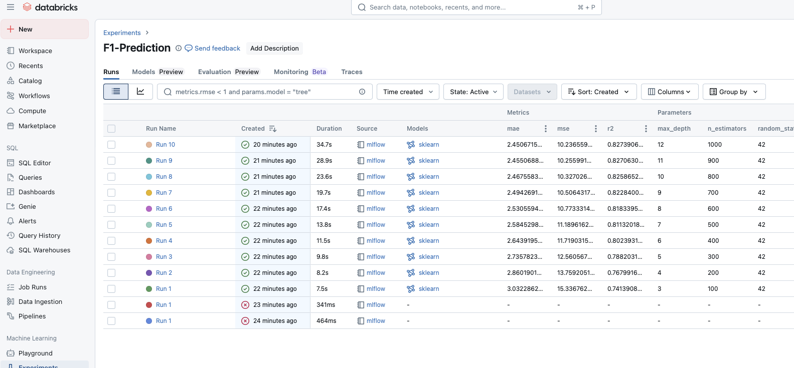
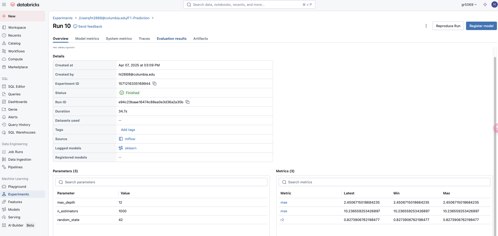
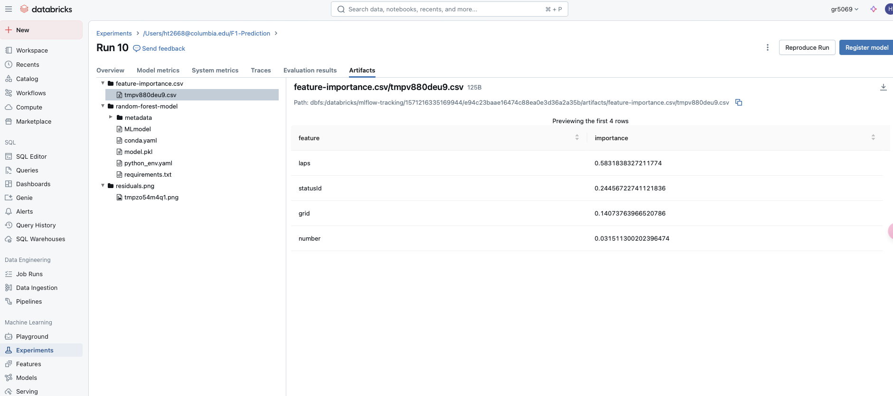

# Homework #4: Model Building and Tracking with MLflow

This assignment uses the F1 `results.csv` dataset from S3 to build a **Random Forest Regressor** that predicts `positionOrder` (final race position).  
MLflow was used to track parameters, metrics, and artifacts across multiple model runs.

## Model Setup

- Model used: `RandomForestRegressor` from `sklearn`
- Target variable: `positionOrder`
- Features used: `grid`, `laps`, `number`, `statusId`
- Data source: `s3://columbia-gr5069-main/raw/results.csv`
- Total runs: **10** experiments with different `max_depth` and `n_estimators`

## 🔍 Best Model (Run 10)

| Parameter      | Value  |
|----------------|--------|
| `max_depth`    | 12     |
| `n_estimators` | 1000   |
| `r2`           | **0.827** |
| `mse`          | **10.24** |
| `mae`          | **2.45** |

**Why this model?**  
It achieved the highest R² and lowest MSE/MAE among all runs, indicating best predictive performance.

## 📸 MLflow Screenshots

### 1. MLflow Experiment Overview (10 runs)

### 2. Best Run (Run 10) Details

### 3. Artifacts (Feature importance & residual plot)

